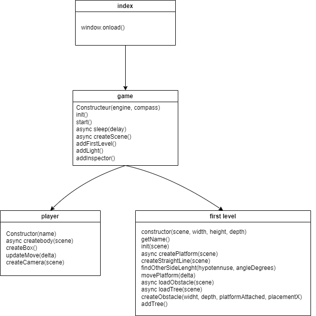

# Yama
It's a game in BabylonJS for the Games on Web 2024 made by :  
ThePhoenix 78 / JulienLcq : Julien Lecocq  
Antoine Bruneau / verix33 : Antoine Bruneau  
Kazenoyama : Kishan Turpin  

## Context:
The goal of this ski game is to compete against an AI in a race down the mountain.  
We want to change the speed of the race and maneuverability with the different type of snow we will add down the line.

## What we did:

We begin our project with the help of the video of Olivier Arguimbau "From Scratch" to setup correctly all our library.  
We then added a player and a first level to have something which can be used to test new idea.  

### Player : 
For the player, we use the model of "From Scratch" for now until we find a better model of someone skiing.  
We attached the camera to player to keep the player on the screen.  
The player can move right and left and have a velocity to keep it moving down the slope.  
The velocity will depend on the angle of the slope and it is capped to a certain speed to prevent the player to accelerate infinitely.  

### First Level :
The first level loads the textures of the platform and load tree and obstacle model.  
It then add them to the scene to be rendered.  
It creates a straight line of 200 platforms.   
We added tree and obstacle to try to compensate the effect of the straight line even if we have our slope going down.  

## What we want to do :
- We want to add an AI to compete against it.  
- A system to upgrade the type of ski to make it faster or more maneuverable. If you win a race you gain coin and you can unlock new type of ski in a shop.  
- Add different types of snow to change the pace of the race:  
Regular snow maintains normal speed and maneuverability.  
Icy snow increases speed faster but decreases lateral maneuverability.  
Powder snow slows down the player but enhances maneuverability, especially around obstacles.  
- Introduce different racing lines that offer both risk and reward. For example, choosing the icy snow line may allow you to potentially outspeed opponents, but there's a higher risk of falling due to reduced maneuverability when dodging obstacles
- And finally add maybe some power-ups along the race to make a more arcade game.  

  

